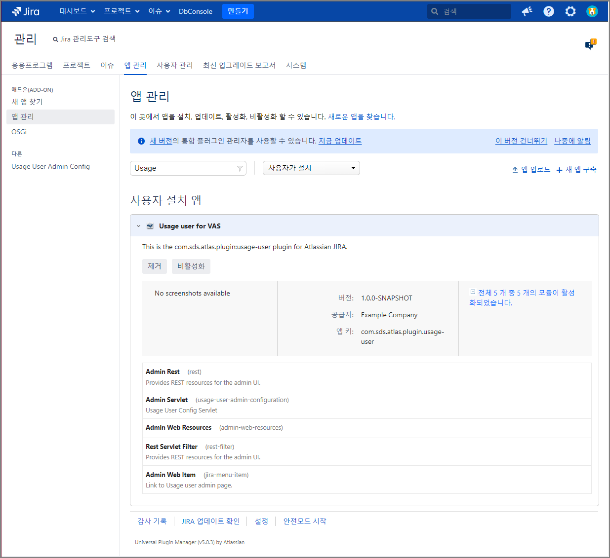
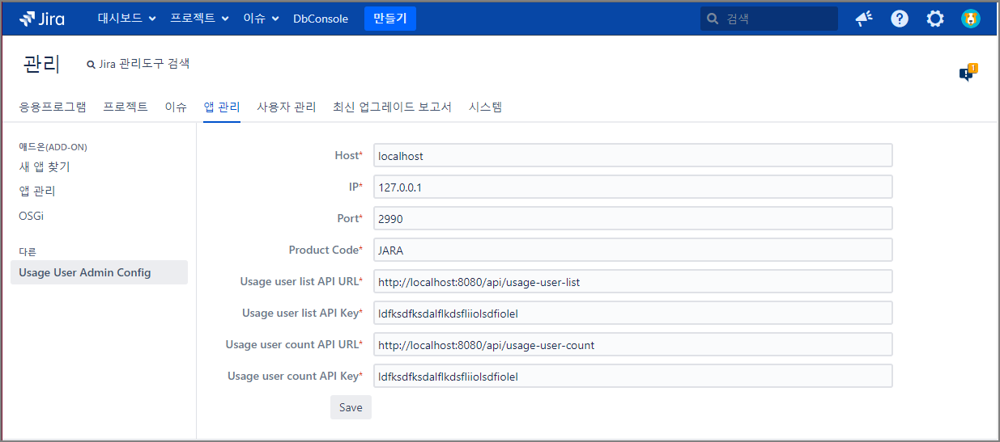
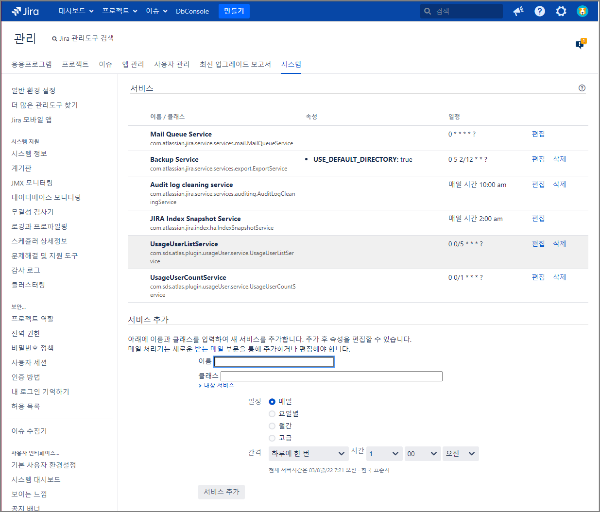

You have successfully created an Atlassian Plugin!

Here are the SDK commands you'll use immediately:

* atlas-run   -- installs this plugin into the product and starts it on localhost
* atlas-debug -- same as atlas-run, but allows a debugger to attach at port 5005
* atlas-help  -- prints description for all commands in the SDK

Full documentation is always available at:

https://developer.atlassian.com/display/DOCS/Introduction+to+the+Atlassian+Plugin+SDK

# 앱 관리

## 앱 관리 화면 이동
1. gg 연타
2. 검색어 "앱 관리" 검색
3. 검색 결과에서 "앱 관리"를 클릭

## 앱 등록
1. "앱 업로드" 링크를 클릭 
2. 앱업로드 팝업에서 파일 선택 버튼 클릭
3. "usage-user-1.0.0-SNAPSHOT.jar" 선택
4. 업로드 버튼 클릭

# 어드민 설정


## 어드민 설정 화면 이동
1. gg 연타
2. 검색어 "Usage User Admin Config" 검색
3. 검색 결과에서 "Usage User Admin Config"를 클릭

## 데이터 입력 및 저장
1. 입력 폼에 내용을 입력
2. "Save" 버튼을 클릭


# 서비스

## 서비스 화면 이동
1. gg 연타
2. 검색어 "서비스" 검색

## Usage user list 서비스 등록
```text
이름: Usage User List Service
클래스: com.sds.atlas.plugin.usageUser.service.UsageUserListService
일정: 매일
간격: 하루에 한 번
시간: 오전 11:30
```
## Usage user count 서비스 등록
```text
이름: Usage User Count Service
클래스: com.sds.atlas.plugin.usageUser.service.UsageUserCountService
일정: 매일
간격: 매 2시간마다
시작: 오전 11:00
끝: 오후 11:00
```